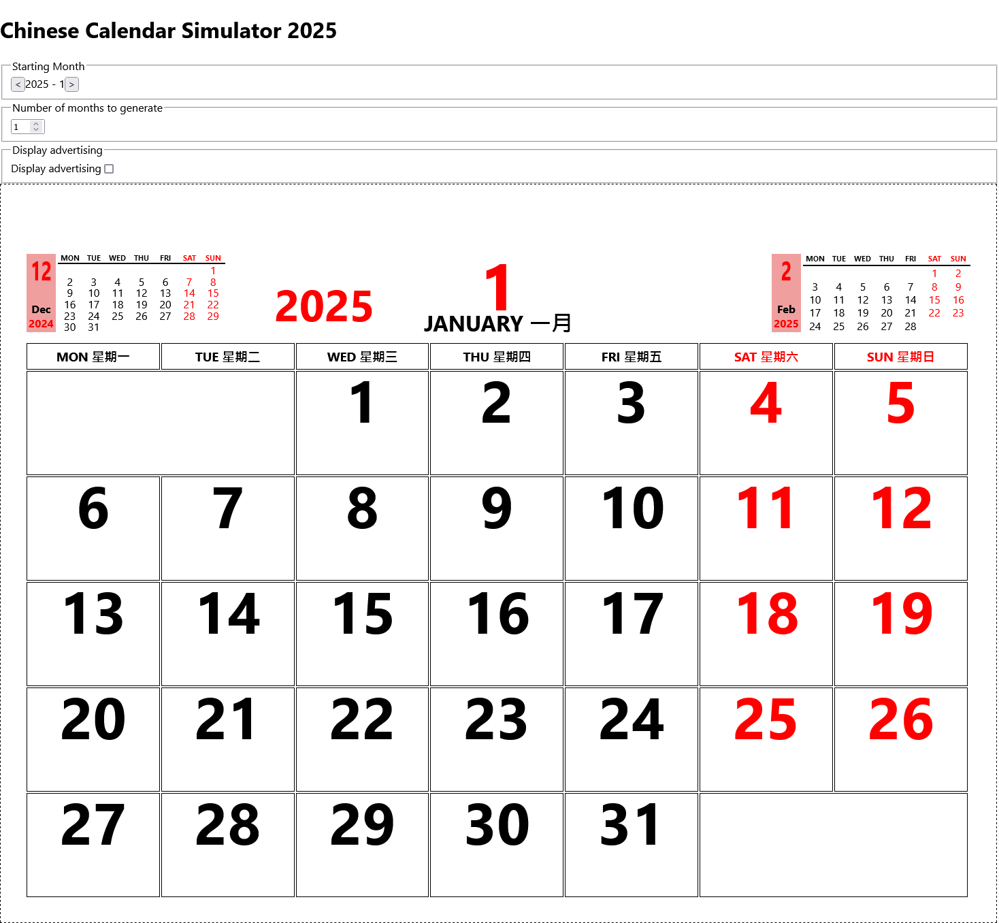

# Chinese Calendar Simulator 2025

Creates chinese looking calendars for retrofitting into the Hoo Hing 2024 calendar.
Fits best within A3 pages (to then cut out with a laser).

## Examples

- [View the generator](https://7coil.github.io/chinese-calendar/)
- [View the PDF](./examples/calendar.pdf)

## Links

- [Hoo Hing Ltd](https://www.hoohing.shop/)
